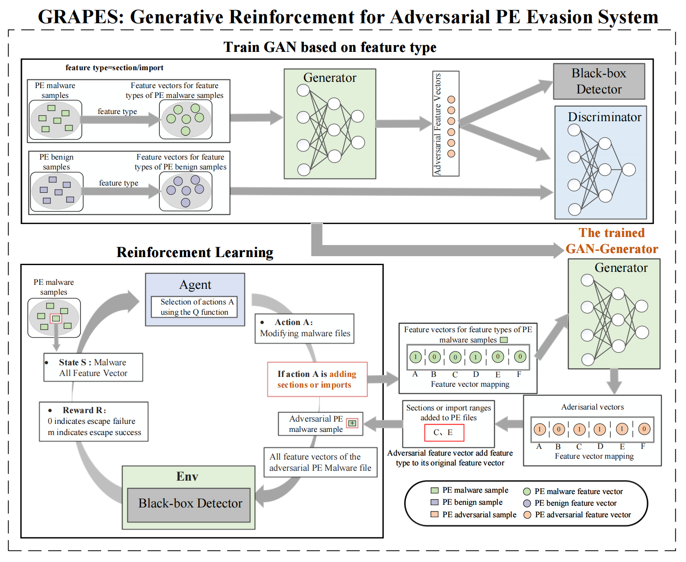

# GRAPES:Genarative Reinforcement for Adversarial PE Evasion System

The flowchart of GRAPES is as follows.


## MalwareRL Gym Environment
MalwareRL exposes `gym` environments for both Ember and MalConv to allow researchers to develop Reinforcement Learning agents to bypass Malware Classifiers. Actions include a variety of non-breaking (e.g. binaries will still execute) modifications to the PE header, sections, imports and overlay and are listed below.

### Action Space
```
ACTION_TABLE = {
    'modify_machine_type': 'modify_machine_type',
    'pad_overlay': 'pad_overlay',
    'append_benign_data_overlay': 'append_benign_data_overlay',
    'append_benign_binary_overlay': 'append_benign_binary_overlay',
    'add_bytes_to_section_cave': 'add_bytes_to_section_cave',
    'add_section_strings': 'add_section_strings',
    'add_section_benign_data': 'add_section_benign_data',
    'add_strings_to_overlay': 'add_strings_to_overlay',
    'add_imports': 'add_imports',
    'rename_section': 'rename_section',
    'remove_debug': 'remove_debug',
    'modify_optional_header': 'modify_optional_header',
    'modify_timestamp': 'modify_timestamp',
    'break_optional_header_checksum': 'break_optional_header_checksum',
}
```

### Observation Space
The `observation_space` of the `gym` environments are an array representing the feature vector. For ember this is `numpy.array == 2381` and malconv `numpy.array == 1024**2`. The MalConv gym presents an opportunity to try RL techniques to generalize learning across large State Spaces.

### Agents
A baseline agent `RandomAgent` is provided to demonstrate how to interact w/ `gym` environments and expected output. This agent attempts to evade the classifier by randomly selecting an action. This process is repeated up to the length of a game (e.g. 50 mods). If the modifed binary scores below the classifier threshold we register it as an evasion. In a lot of ways the `RandomAgent` acts as a fuzzer trying a bunch of actions with no regard to minimizing the modifications of the resulting binary.

Additional agents will be developed and made available (both model and code) in the coming weeks.

**Table 1:** _Evasion Rate against VirueShare Holdout Dataset_*
| gym | agent | evasion_rate | avg_ep_len |
| --- | ----- | ------------ | ---------- |
| malconv | RandomAgent | 88.5% | 16.33

\
\* _250 random samples_

## Setup
To get `malware_rl` up and running you will need the follow external dependencies:
- [LIEF](https://lief.quarkslab.com/)
- [Ember](https://github.com/Azure/2020-machine-learning-security-evasion-competition/blob/master/defender/defender/models/ember_model.txt.gz), [Malconv](https://github.com/endgameinc/ember/blob/master/malconv/malconv.h5) and [SOREL-20M](https://github.com/sophos-ai/SOREL-20M) models. All of these then need to be placed into the `malware_rl/envs/utils/` directory.
  > The SOREL-20M model requires use of the `aws-cli` in order to get. When accessing the AWS S3 bucket, look in the `sorel-20m-model/checkpoints/lightGBM` folder and fish out any of the models in the `seed` folders. The model file will need to be renamed to `sorel.model` and placed into `malware_rl/envs/utils` alongside the other models.
- UPX has been added to support pack/unpack modifications. Download the binary [here](https://upx.github.io/) and place in the `malware_rl/envs/controls` directory.
- Benign binaries - a small set of "trusted" binaries (e.g. grabbed from base Windows installation) you can download some via MSFT website ([example](https://download.microsoft.com/download/a/c/1/ac1ac039-088b-4024-833e-28f61e01f102/NETFX1.1_bootstrapper.exe)). Store these binaries in `malware_rl/envs/controls/trusted`
- Run `strings` command on those binaries and save the output as `.txt` files in `malware_rl/envs/controls/good_strings`
- Download a set of malware from VirusShare or VirusTotal. I just used a list of hashes from the Ember dataset

**Note:** The helper script `download_deps.py` can be used as a quickstart to get most of the key dependencies setup.

I used a [conda](https://docs.conda.io/en/latest/) env set for Python3.8:

`conda create -n grapes python=3.8`

Finally install the Python3 dependencies in the `requirements.txt`.

`pip3 install -r requirements.txt`

## References
- Anderson, Hyrum S., et al. "Learning to evade static pe machine learning malware models via reinforcement learning." arXiv preprint arXiv:1801.08917 (2018).([paper](https://arxiv.org/abs/1801.08917))
- Hu, W., & Tan, Y. (2022, November). Generating adversarial malware examples for black-box attacks based on GAN. In International Conference on Data Mining and Big Data (pp. 409-423). Singapore: Springer Nature Singapore.([paper](https://link.springer.com/chapter/10.1007/978-981-19-8991-9_29))
- Fang, Zhiyang, et al. "Evading anti-malware engines with deep reinforcement learning." IEEE Access 7 (2019): 48867-48879. ([paper](https://ieeexplore.ieee.org/stamp/stamp.jsp?arnumber=8676031))

## Acknowledges
- Gym-Malware Environment: https://github.com/endgameinc/gym-malware. 
- Zayd Hammoudeh's (https://github.com/ZaydH/MalwareGAN) work. 


